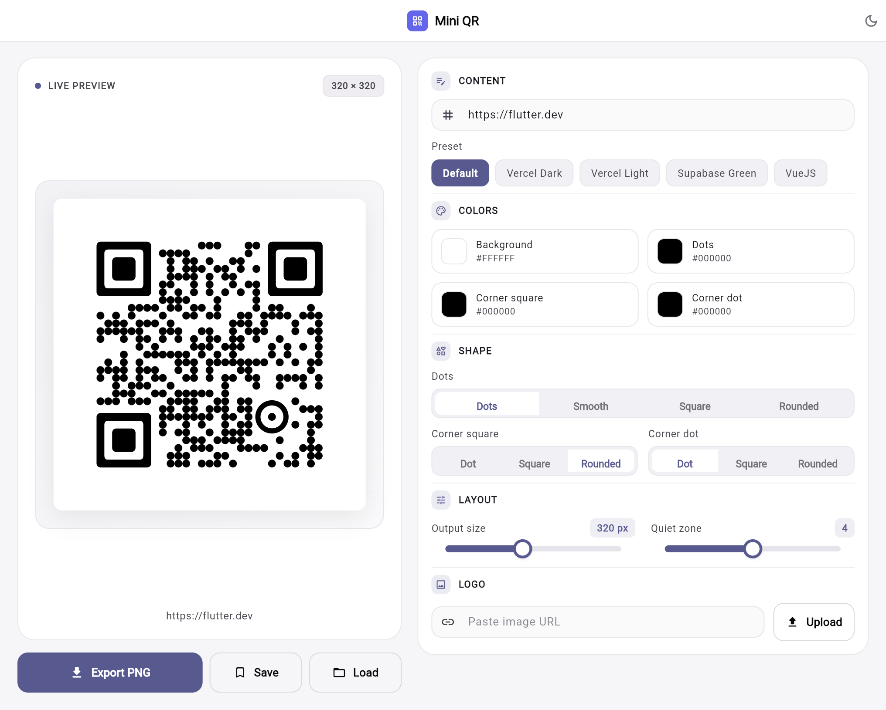

# Flutter QR

Flutter QR is a polished Flutter web app for generating, styling, and exporting custom QR codes. It combines a live preview, theme presets, logo support, and quick export workflows so you can tailor a QR code for links, product pages, event invites, or internal tools.

## Why this project exists

This app was built to make QR code customization simple:

- tweak colors, shapes, quiet zones, and corner styles in real time
- apply preset themes for fast visual experiments
- add a logo or image to the center of the QR code
- download the result as a PNG or save/load the full configuration as JSON

## Highlights

- Live QR preview with instant updates
- Preset themes such as Dark, Light, Green, and Vue-inspired styles
- Custom logo support via file picker or URL
- Export to PNG and JSON for sharing or reuse
- Responsive layout for desktop and smaller screens

## Screenshots



## Try it

A live demo link will be added here soon.

If you want to preview it locally right now, run the app and open the local URL shown in the terminal.

## Tech stack

- Flutter
- Dart
- Material Design widgets
- pretty_qr_code for rendering
- flex_color_picker for color selection
- file_picker for importing logos
- shared_preferences for saving the last configuration

## Project structure

- lib/app.dart — app shell and top-level theme wrapper
- lib/features/create/create_page.dart — main QR builder screen
- lib/features/create/widgets/ — preview, style controls, export actions
- lib/models/qr_config.dart — QR configuration model and JSON helpers
- lib/services/ — export, config persistence, and web helpers
- test/ — widget and model tests

## Getting started

### Prerequisites

Install Flutter SDK 3.10 or newer and make sure the Flutter toolchain is available on your PATH.

### Install dependencies

```sh
flutter pub get
```

### Run the app

For a browser preview:

```sh
flutter run -d chrome
```

Or, if you want a simple local web server:

```sh
flutter run -d web-server --web-port 3000
```

### Run tests

```sh
flutter test
```

## How the app works

1. Start with a preset or the default QR configuration.
2. Edit the data string, colors, shapes, logo, and size in the control panel.
3. Watch the preview update immediately.
4. Export the final QR code as PNG or save the configuration to JSON for later.

## Export and configuration

The app supports two main output paths:

- PNG export for sharing or embedding in docs and marketing materials
- JSON export/import for saving the exact style and data configuration

This makes it easy to iterate on a design and come back to the same settings later.

## Development notes

- The main UI is intentionally responsive and works in both wide and narrow layouts.
- The current implementation targets Flutter web, but the core QR generation logic is compatible with other Flutter targets.
- The app persists the most recent config locally so your last edit is ready on the next launch.

## License

This project is distributed under the MIT License. See the LICENSE file for details.
